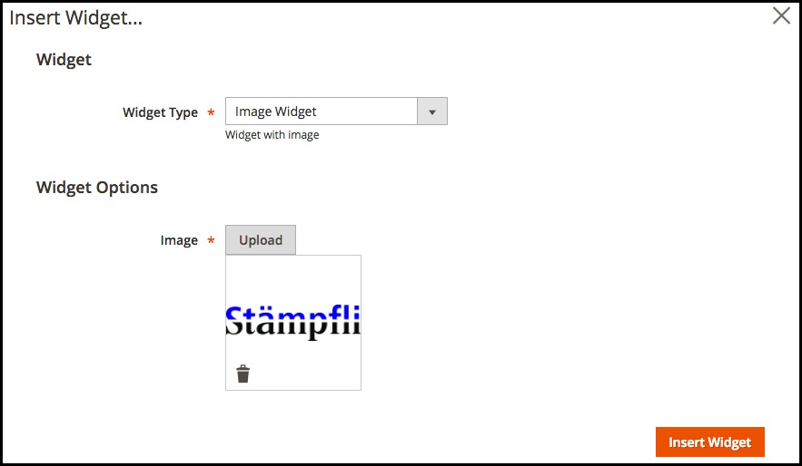

# Magento 2 Widget Extra Fields

[](http://www.repostatus.org/#abandoned)
[](https://www.codacy.com/app/Staempfli/magento2-module-widget-extra-fields?utm_source=github.com&amp;utm_medium=referral&amp;utm_content=staempfli/magento2-module-widget-extra-fields&amp;utm_campaign=Badge_Grade)
[](https://codeclimate.com/github/staempfli/magento2-module-widget-extra-fields)
[](https://codeclimate.com/github/staempfli/magento2-module-widget-extra-fields)

Magento 2 module to add extra field types on widgets

## Installation

```
$ composer require "staempfli/magento2-module-widget-extra-fields":"~1.0"
```

## Usage

### ImageField

Use `Staempfli\WidgetExtraFields\Block\Adminhtml\ImageField` as `block` type in your widget parameter

```
<widget id="<widget_id>" class="Vendor\Module\Block\Widget\<Your_Widget>" >
    <label translate="true">Widget Name</label>
    <description>Widget Description</description>
    <parameters>
        <parameter name="image" xsi:type="block" visible="true" sort_order="100" required="true">
            <label translate="true">Image</label>
            <block class="Staempfli\WidgetExtraFields\Block\Adminhtml\ImageField"/>
        </parameter>
    </parameters>
</widget>
```



## Prerequisites

- PHP >= 7.0.*
- Magento >= 2.1.*

## Developers

Juan Alonso, and all other [contributors](https://github.com/staempfli/magento2-module-widget-extra-fields/contributors)

## License

[Open Software License ("OSL") v. 3.0](https://opensource.org/licenses/OSL-3.0)

## Copyright

(c) 2017, Stämpfli AG
